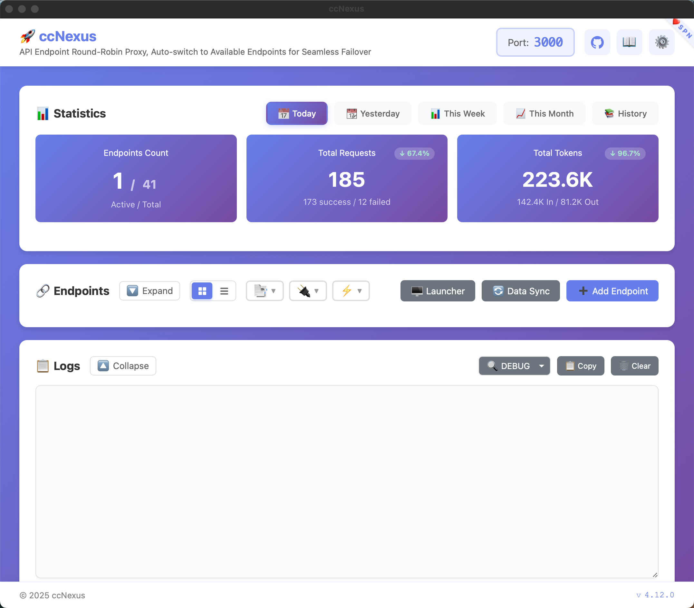
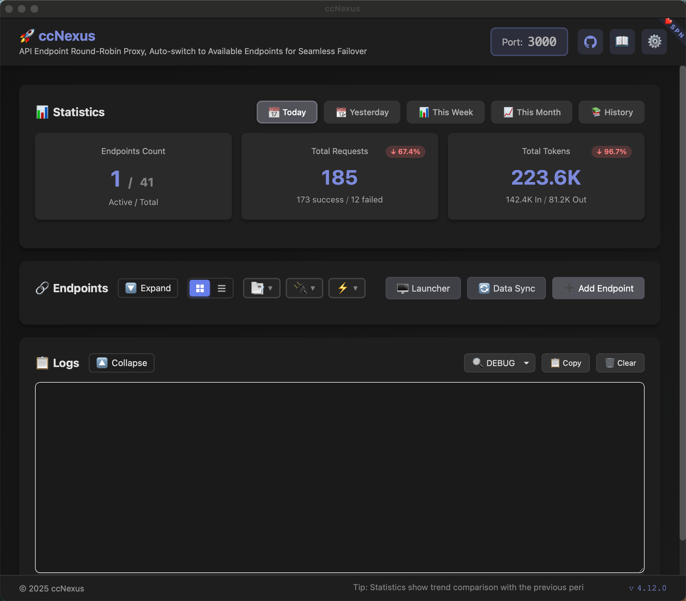

<div align="center">

<p align="center">
  
</p>

[](https://github.com/milome/code-agent-lens/actions)
[](https://opensource.org/licenses/MIT)
[](https://go.dev/)
[](https://wails.io/)

[English](README_EN.md) | [简体中文](../README.md)

</div>

## Features

- **Multi-Endpoint Rotation**: Automatic failover, switches to next endpoint on failure
- **API Format Conversion**: Supports Claude, OpenAI, Gemini format conversion
- **Codex Token Pool**: Bulk import `access_token/refresh_token` credentials with auto-rotation, auto-refresh, invalid-token isolation, and status management
- **Token Pool Usage Insights**: Per-credential requests/errors/token counts with quick view
- **Real-time Statistics**: Event-driven zero-latency stats updates with instant switching between 4 periods (daily/yesterday/weekly/monthly)
- **Endpoint Filtering**: Multi-select filtering by type, availability, and status for quick endpoint location
- **Local Data Ownership**: Configuration and usage data stay in the local SQLite database
- **Cross-Platform**: Windows, macOS, Linux

<table>
  <tr>
    <td align="center"></td>
    <td align="center"></td>
  </tr>
</table>

## Quick Start

### 1. Download and Install

[Download Latest Release](https://github.com/milome/code-agent-lens/releases/latest)

- **Windows**: Extract and run `CodeAgentLens.exe`
- **macOS**: Move to Applications, right-click → Open for first run
- **Linux**: `tar -xzf CodeAgentLens-linux-amd64.tar.gz && ./CodeAgentLens`

### 2. Add Endpoints

Click "Add Endpoint", fill in API URL, key, and select transformer (claude/openai/gemini/openai2).

For Codex Token Pool mode:
- Set auth mode to `Codex Token Pool`
- Import token JSON records in the Token Pool page (`access_token` + `refresh_token`)
- CodeAgentLens will handle token rotation, 401-triggered refresh, and lifecycle statuses (active/expiring/need_refresh/invalid, etc.)

### 3. Configure CC

#### Claude Code
`~/.claude/settings.json`
```json
{
  "env": {
    "ANTHROPIC_AUTH_TOKEN": "anything, not important",
    "ANTHROPIC_BASE_URL": "http://127.0.0.1:3010",
    "CLAUDE_CODE_MAX_OUTPUT_TOKENS": "64000", // Some models may not support 64k
  }
  // Other settings
}

```

#### Codex CLI
Just configure `~/.codex/config.toml`:
```toml
model_provider = "CodeAgentLens"
model = "gpt-5-codex"
preferred_auth_method = "apikey"

[model_providers.CodeAgentLens]
name = "CodeAgentLens"
base_url = "http://localhost:3010/v1"
wire_api = "responses"  # or "chat"

# Other settings
```

`~/.codex/auth.json` can be ignored.

## Runtime Notes

- CodeAgentLens listens on port `3000` by default. Override it with the `-port` CLI flag or `CODE_AGENT_LENS_PORT`.
- If Basic Auth is enabled and no password is stored, the app generates a random password on first launch and prints it to logs.
- For headless deployments, prefer a trusted LAN or put CodeAgentLens behind a reverse proxy with TLS and access control.

## Support

Use GitHub Issues for bug reports and GitHub Discussions for usage questions.

## Documentation

- [Configuration Guide](configuration_en.md)
- [Development Guide](development_en.md)
- [FAQ](FAQ_en.md)

## License

[MIT](LICENSE)
